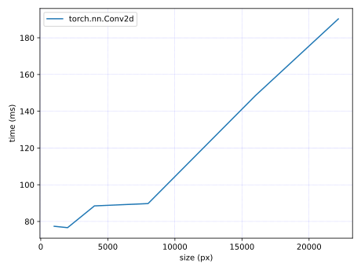

# RAMSavingConv2d

A PyTorch implementation of RAMSavingConv2d in the paper "Save GPU RAM Usage in Convolutional Layers to Load Huge Whole Slide Images" (preprint) .
preprint: https://www.biorxiv.org/content/10.1101/2023.09.19.558533v1

# Installation

```bash
pip install git+https://github.com/tand826/RAMSavingConv2d
```

# Example

```python
import torch.nn as nn
default = nn.Conv2d(3, 16, kernel_size=7, stride=2, padding=3, dilation=1)

from rsconv.ramsaving_conv2d import RSConv2d
ramsaving = RSConv2d(3, 16, kernel_size=7, stride=2, padding=3, dilation=1)
```

# RAM Consumption

- forward


- backward


```
# to check the ram consumption on your device
cd scripts
bash ram.sh
python graph_ram.py
```

# Time Efficiency

- forward


- backward




```
# to check the time efficiency on your device
cd scripts
bash time.sh
python graph_time.py
```

# Maximum Loadable Size

|Layers|Forward|Forward+Backward(w/ input grad)|Forward+Backward(w/o input grad)|
|:---:|:---:|:---:|:---:|
|torch.nn.Conv2d|23000|23000|N/A|
|RSConv|34500|26500|34500|

```
# to check the maximum loadable size on your device
cd scripts
bash size.sh
# see time.csv
```